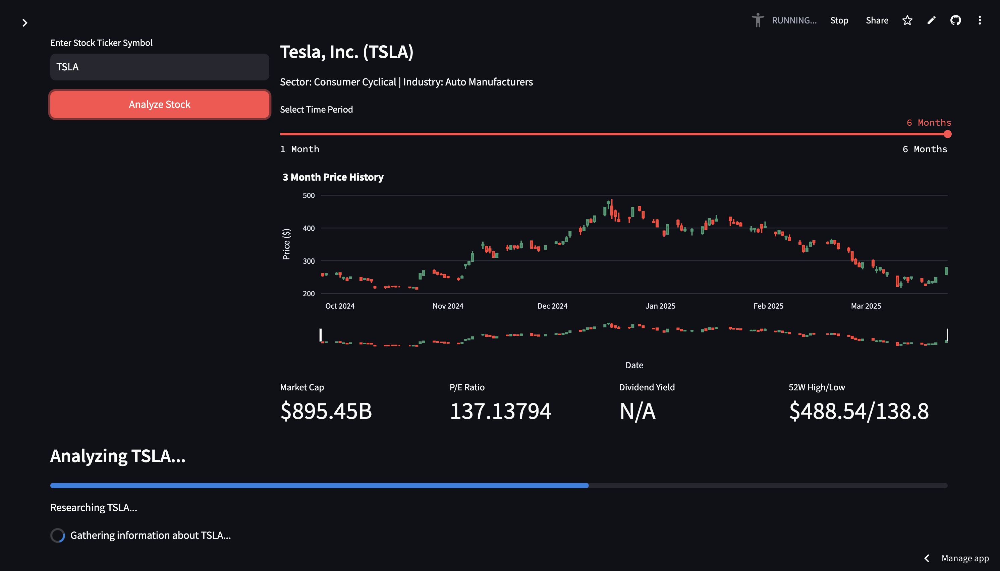

# CrewAI Financial Research Assistant - Streamlit App

This blog presents a Streamlit application that demonstrates the power of CrewAI's agent architecture through a financial research assistant. This app create a specialized AI agent to analyze stocks.

## Features

- **Agent Analysis**: The specialized AI agent works to analyze stocks:
  - Financial Research Specialist: Gathers information about companies, market trends, and news.

- **Interactive UI**: Users can input stock symbols, configure analysis parameters, and explore results through an intuitive Streamlit interface.

- **Visualization**: Real-time stock data visualization, sentiment analysis, and architecture diagrams.

## Live Demo

[crewai-stock-research.streamlit.app](https://crewai-stock-research.streamlit.app/)

## Screenshots



## Or, try it out yourself by running the code below.

## Installation

1. Clone this repository
2. Install the required packages:
   ```
   pip install -r requirements.txt
   ```
3. Set up your API keys:
   - Create a `.env` file with the following:
     ```
     OPENAI_API_KEY=your_openai_api_key
     SERPER_API_KEY=your_serper_api_key
     ```

## Usage

Run the Streamlit app:
```
streamlit run app.py
```

The app will open in your default web browser. Enter a stock ticker symbol, configure your analysis parameters, and click "Analyze Stock" to start the process.

## Project Structure

```
├── app.py              # Main Streamlit application
├── requirements.txt    # Package dependencies
├── .env.example        # Example environment variables file
├── .env                # Environment variables (Optional, or add directly in the app)
├── blog.md             # Blog post content uploaded to 
└── README.md           # This file
```

## Example Usage

1. Enter a stock ticker (e.g., "AAPL")
2. Select your preferred configuration
3. Click "Analyze Stock"
4. Explore the generated research, analysis, and news about the company

## Additional Resources

- [CrewAI GitHub Repository](https://github.com/crewAIInc/crewAI)
- [CrewAI Documentation](https://docs.crewai.com/)
- [Examples Repository](https://github.com/crewAIInc/crewAI-examples)